<div align="center">


# CRESTA

### Your Wealth, Powered by Intelligence

*Production-grade AI Robo-Advisory for Indian Equity Markets*

[](https://reactjs.org/)
[](https://djangoproject.com/)
[](https://pytorch.org/)
[](https://postgresql.org/)
[](https://redis.io/)
[](https://docker.com/)
[](LICENSE)
[]()

**[Live Demo →](https://crestafinance.me)** · **[Author →](#author)**

</div>

---

## Screenshots

<table>
  <tr>
    <td align="center" width="50%">
      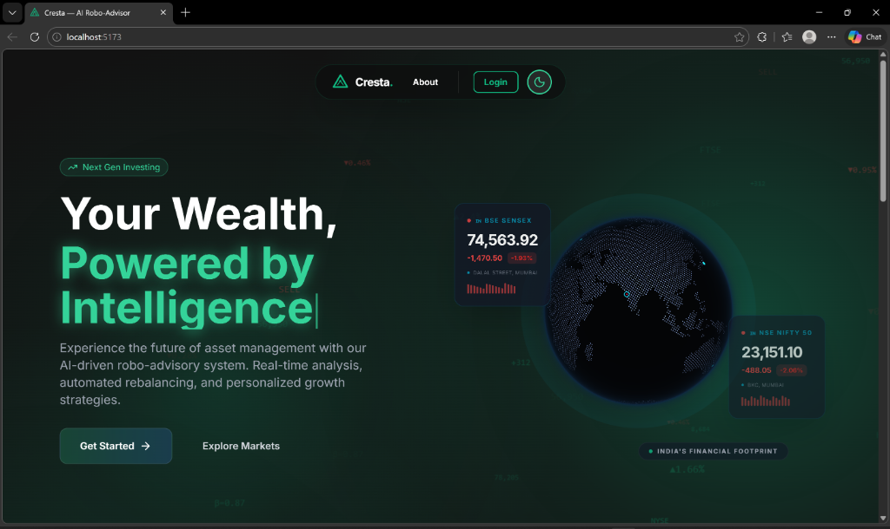
      <br /><sub><b>Dark Mode Landing</b> — live SENSEX/NIFTY ticker, 3D COBE globe, breathing emerald gradient, floating market data.</sub>
    </td>
    <td align="center" width="50%">
      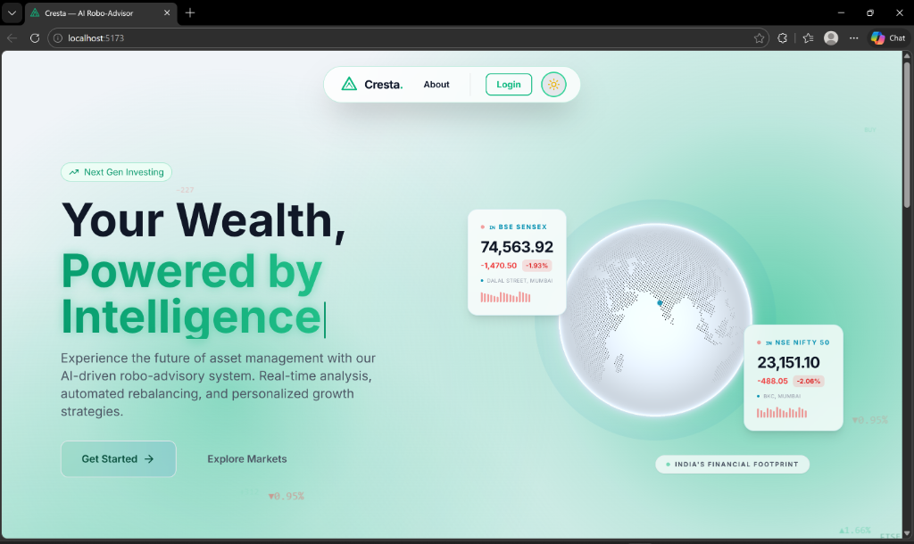
      <br /><sub><b>Light Mode Landing</b> — same data, zero compromise on readability. Globe adapts palette automatically.</sub>
    </td>
  </tr>
  <tr>
    <td align="center" width="50%">
      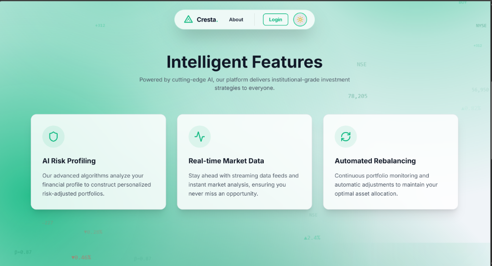
      <br /><sub><b>Intelligent Features</b> — AI Risk Profiling, Real-time Market Data, Automated Rebalancing cards.</sub>
    </td>
    <td align="center" width="50%">
      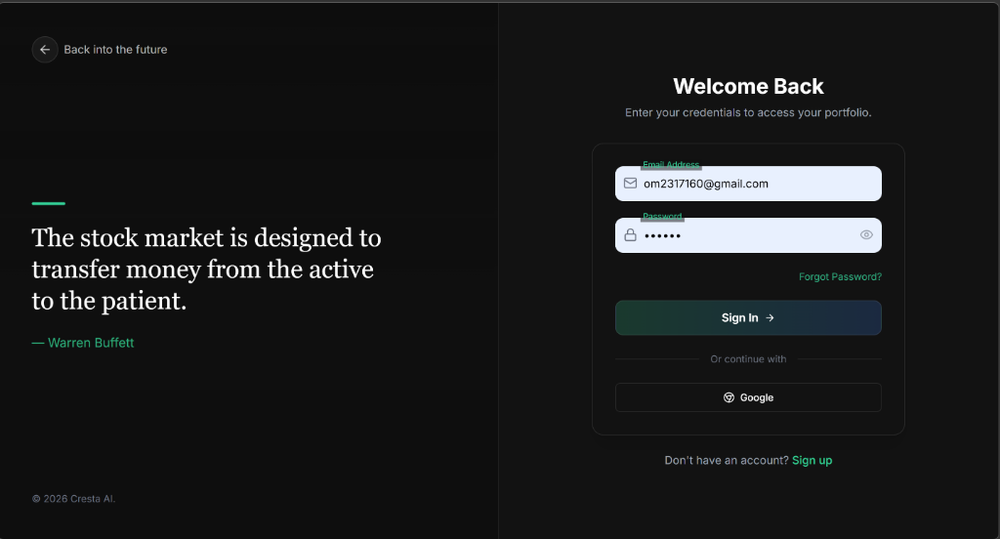
      <br /><sub><b>Login Page</b> — Warren Buffett quote, Google OAuth, JWT authentication, sign up flow.</sub>
    </td>
  </tr>
  <tr>
    <td align="center" width="50%">
      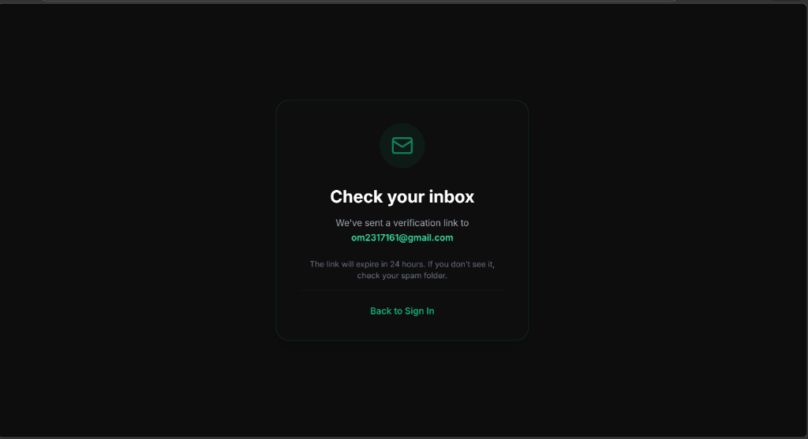
      <br /><sub><b>Email Verification</b> — token-based verification for all new signups, 24-hour expiry.</sub>
    </td>
    <td align="center" width="50%">
      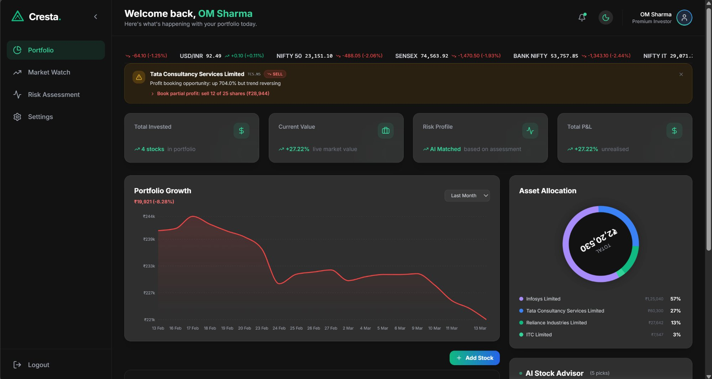
      <br /><sub><b>Portfolio Dashboard</b> — total invested, current value, P&L, asset allocation donut, live ticker tape, AI alerts.</sub>
    </td>
  </tr>
  <tr>
    <td align="center" width="50%">
      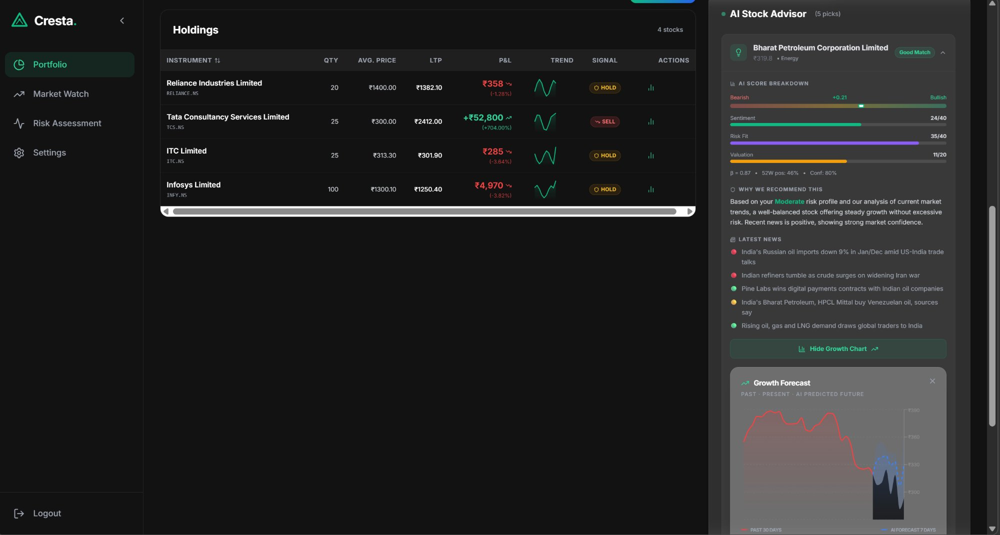
      <br /><sub><b>Holdings + AI Advisor</b> — sparkline trends, BUY/SELL/HOLD signals, AI Score breakdown (Sentiment/Risk Fit/Valuation), personalized news.</sub>
    </td>
    <td align="center" width="50%">
      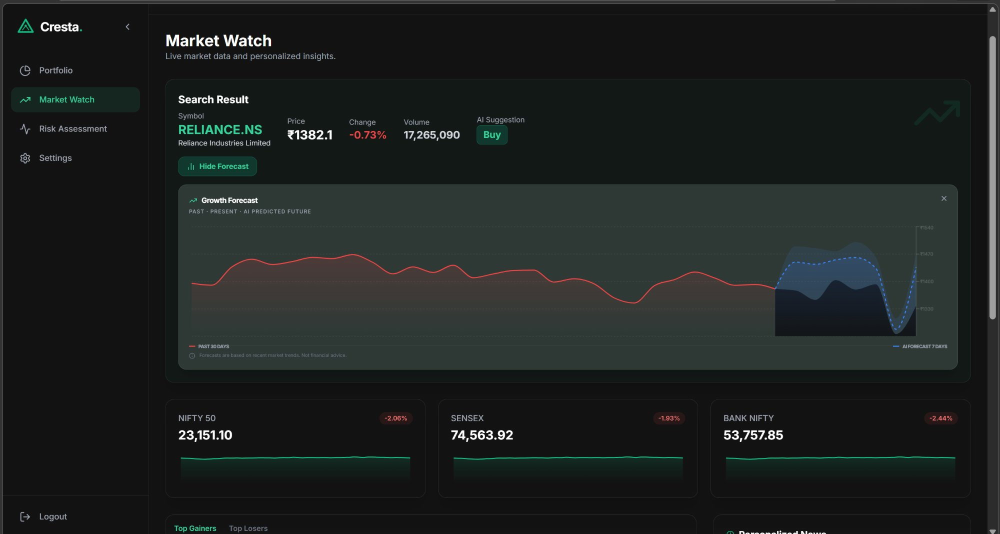
      <br /><sub><b>Market Watch</b> — stock search, 30-day historical + 7-day AI forecast, dynamic red/green coloring, NIFTY/SENSEX/BANK NIFTY indices.</sub>
    </td>
  </tr>
  <tr>
    <td align="center" width="50%">
      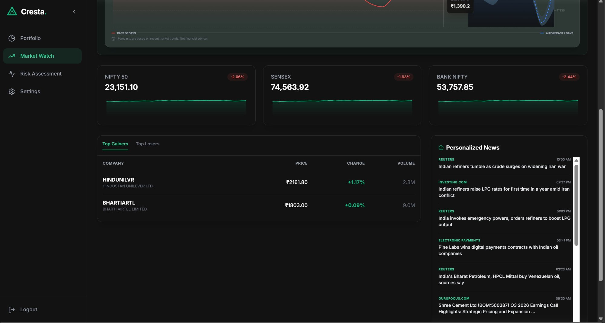
      <br /><sub><b>Personalized News Feed</b> — top gainers/losers, Reuters/Bloomberg headlines filtered by portfolio holdings.</sub>
    </td>
    <td align="center" width="50%">
      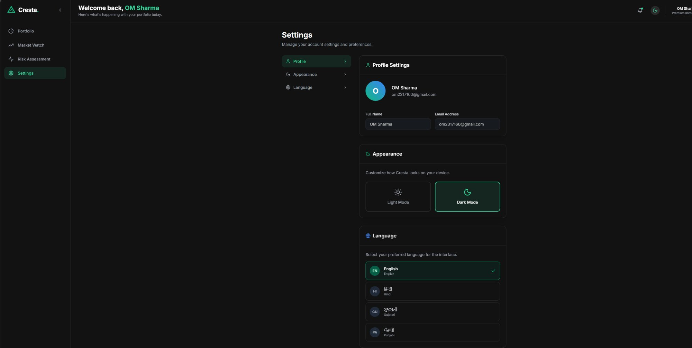
      <br /><sub><b>Settings</b> — profile management, dark/light mode toggle, language selection (English, Hindi, Gujarati, Punjabi).</sub>
    </td>
  </tr>
  <tr>
    <td align="center" width="100%">
      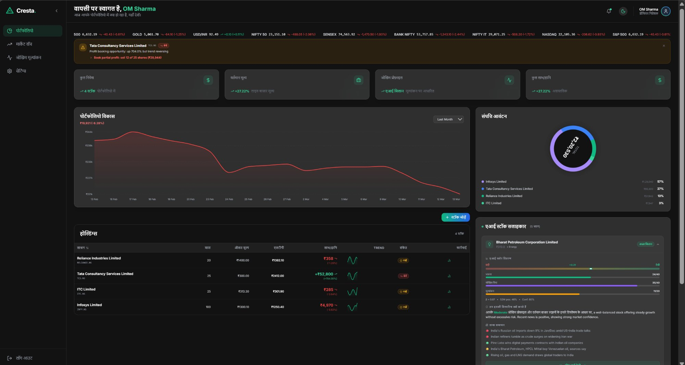
      <br /><sub><b>Full Hindi Mode</b> — entire dashboard rendered in Hindi including nav, tooltips, AI reasoning, holdings table, and alerts. Gujarati and Punjabi also supported.</sub>
    </td>
  </tr>
</table>

---

## Why Cresta?

Zerodha and Groww give you a brokerage. Smallcase gives you curated baskets. **Cresta gives you a reasoning engine.**

| | Zerodha / Groww | Smallcase | Wealthfront | **Cresta** |
|---|---|---|---|---|
| AI Stock Scoring | ✗ | ✗ | Partial | ✅ Ensemble ML (LSTM + XGBoost + ARIMA + FinBERT) |
| Explainable Signals | ✗ | ✗ | ✗ | ✅ Sentiment / Risk Fit / Valuation breakdown |
| Indian Language Support | ✗ | ✗ | ✗ | ✅ Hindi, Gujarati & Punjabi |
| 7-day Price Forecast | ✗ | ✗ | ✗ | ✅ Walk-forward validated ensemble |
| Email Watchlist Alerts | ✓ | ✗ | ✓ | ✅ Trigger-based, configurable |
| Risk Profiling (ML) | ✗ | ✗ | ✓ | ✅ XGBoost + NFCS 2021 real survey data |
| Email Verification | ✗ | ✗ | ✓ | ✅ Token-based, 24-hour expiry |

> Built for the 200M+ Indians who invest without institutional-grade tooling.

---

## 📊 ML Evaluation Metrics

### 1. 🧠 Intelligent Risk Profiling

Cresta dynamically classifies users as **Conservative, Moderate, or Aggressive** based on Age, Income, Investment Goals, and Risk Tolerance.

* **Model:** XGBoost Classifier
* **Dataset:** 25,000 profiles — 2,578 real NFCS 2021 Investor Survey respondents (FINRA Foundation) augmented with 22,422 synthetic profiles generated via SEBI income capacity guideline distributions and empirical behavioral noise.
* **Accuracy:** 68% (Validated on heterogeneous synthetic noise)
* **Aggressive Recall:** 97% — solved the high-bias "Moderate" issue

**Explainable AI (XAI) — Feature Importance:**

| Feature | Importance |
|---|---|
| Risk Tolerance | 61.35% |
| Income | 17.81% |
| Investment Goal | 14.75% |
| Age | 3.88% |
| Experience | 2.21% |

---

### 2. 📈 Tier-2 Quant Stock Forecasting

* **Architecture:** Attention-LSTM Hybrid + XGBoost + ARIMA Ensemble
* **Attention Mechanism:** Applies learned temporal weights across LSTM hidden states, allowing the model to selectively focus on the most predictive time steps rather than treating all historical observations equally.
* **Ensemble Weights:** (0.70 LSTM / 0.10 XGBoost / 0.20 ARIMA) selected via validation MAPE minimization across walk-forward folds — LSTM dominates long-horizon trend capture while ARIMA stabilizes short-term variance.
* **Features (16):** Close, Volume, SMA (5, 20), RSI (14), MACD, Bollinger Bands, OBV, FinBERT Sentiment (daily NSE-listed company headlines via yfinance news API, aggregated as mean sentiment score per ticker across all articles published within 24 hours), USD/INR Exchange Rate, India VIX, Crude Oil Futures
* **Validation:** Strict Walk-Forward Validation (3-fold expanding window, minimum 45-day folds) — no look-ahead bias
* **Seed:** Fixed at 42 for full reproducibility
* **Dataset:** 20 years of historical Nifty50 daily data (via Kaggle & `yfinance`)

**Forecasting Performance (Walk-Forward Validated):**

| Ticker | Sector | Avg Ensemble MAPE | Status |
|---|---|---|---|
| RELIANCE.NS | Energy/Conglomerate | 1.33% | ✅ Verified |
| TCS.NS | IT Services | 3.85% | ✅ Verified |
| INFY.NS | IT Services | 2.69% | ✅ Verified |
| HDFCBANK.NS | Banking | 2.67% | ✅ Verified |
| ICICIBANK.NS | Banking | 2.51% | ✅ Verified |
| SUNPHARMA.NS | Pharma | 0.82% | ✅ Verified |
| MARUTI.NS | Auto | 7.66% | ✅ Verified |
| ONGC.NS | Energy | 4.30% | ✅ Verified |

**Average Ensemble MAPE across test set: 3.23%** (Dramatic improvement from ~11-18%)

---

## ML Pipeline

```
Raw Market Data (OHLCV + News Headlines)
         │
         ▼
┌─────────────────────────────────────────────┐
│              Feature Engineering             │
│  RSI · MACD · Bollinger · SMA · OBV ·       │
│  India VIX · USD/INR · Crude · FinBERT      │
└───────────────────┬─────────────────────────┘
                    │  16 features
         ┌──────────┴──────────┐
         ▼                     ▼
  ┌─────────────┐       ┌─────────────┐
  │ Attention-  │       │  XGBoost    │
  │   LSTM      │       │  Regressor  │
  │ (temporal)  │       │ (tabular)   │
  └──────┬──────┘       └──────┬──────┘
         │                     │
         ▼                     ▼
  ┌─────────────┐       ┌─────────────┐
  │    ARIMA    │       │   FinBERT   │
  │ (baseline)  │       │  (NLP sent) │
  └──────┬──────┘       └──────┬──────┘
         └─────────┬───────────┘
                   ▼
          ┌────────────────┐
          │    Ensemble    │
          │  0.70/0.10/0.20│
          └───────┬────────┘
                  ▼
     AI Score + BUY / SELL / HOLD
          7-day Price Forecast
```

---

## 🏗️ System Architecture

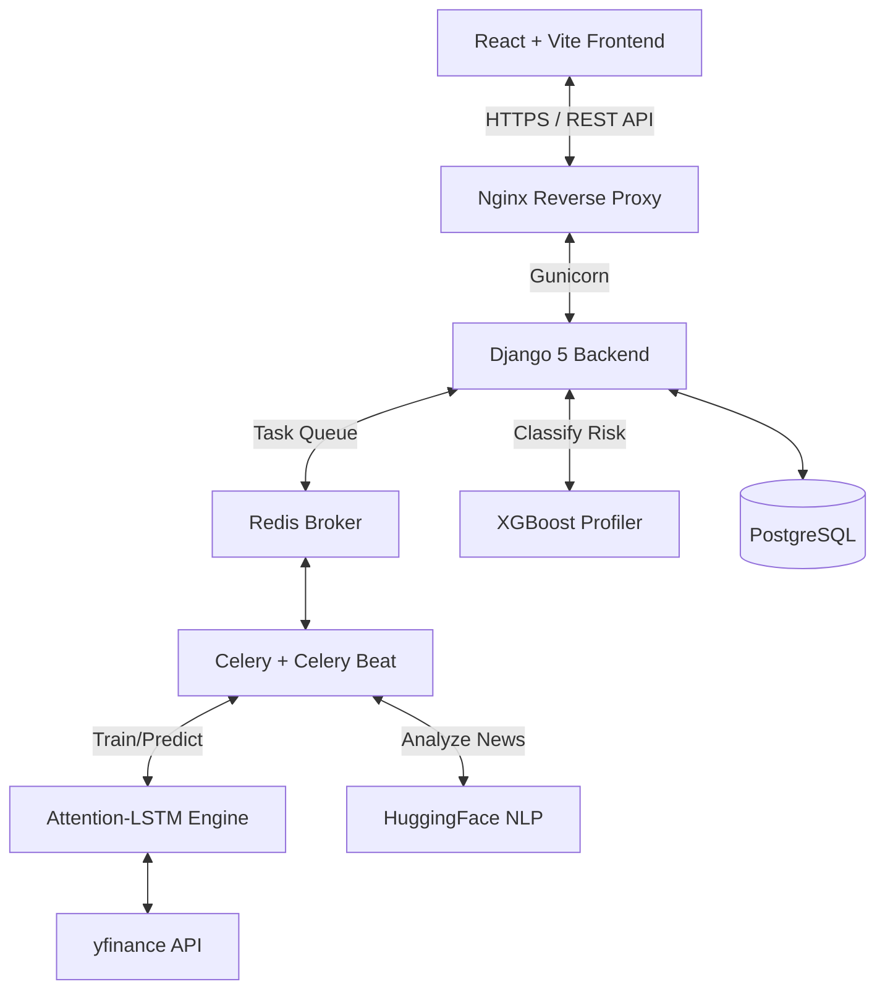

### 🗄️ Database Schema

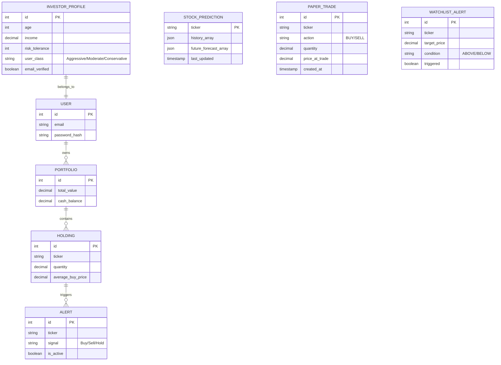

---

## ✨ Core Features

### 🌍 Interactive 3D Global Exchange Globe
* **7 Global Exchanges:** BSE SENSEX, NSE NIFTY 50, FTSE 100, NYSE/DOW, IBOVESPA, NIKKEI 225, ASX 200
* **Geographic Sync:** Angular-distance phi detection ensures correct exchange card appears when that continent faces the camera
* **Live Data:** BSE SENSEX and NSE NIFTY 50 prices fetched live from backend API
* **Theme-Aware:** Globe adapts palette for Light and Dark mode via `ThemeContext`

### 🎨 Premium Emerald Design System
* **Dark Mode:** Deep charcoal `#121212` · **Light Mode:** Cool off-white `#f0f4f8`
* **Animated Background:** Canvas-based breathing gradient with 3 independent radial emerald glows + 45 floating market data numbers (SENSEX values, ₹ prices, ▲▼ indicators)
* **Complete cyan→emerald migration** across all components, Tailwind config, and CSS variables

### 🤖 Explainable AI (XAI) & Fiduciary Scoring
* **Sentiment (40 pts):** FinBERT NLP on daily NSE-listed company headlines
* **Risk Fit (40 pts):** Stock Beta matched against ML-classified user risk profile
* **Valuation (20 pts):** Price positioning relative to 52-week high/low
* Natural language reasoning generated per stock for full fiduciary transparency

### 📈 Performance-Driven Data Visualization
* Dynamic green/red chart coloring across all charts based on price direction
* Growth Forecast: historical line colored by trend, AI forecast in blue with confidence shading
* Portfolio chart, holdings sparklines, market indices all follow same logic

### 🔐 Security & Authentication
* JWT with 15-minute access tokens and HttpOnly refresh rotation
* **Email Verification:** Token-based verification for all new signups (24-hour expiry, SMTP delivery)
* Google OAuth integration
* Stock ticker inputs validated against NSE/BSE suffix whitelist
* Computational DoS mitigation via PostgreSQL prediction cache
* Production: `SECURE_SSL_REDIRECT`, `X-Frame-Options: DENY`, strict HSTS

### 🌐 Deep Localization (i18n)
* `react-i18next` supporting **English, Hindi, Gujarati, and Punjabi**
* All UI components, ML reasoning strings, and alerts translatable

### 📊 Portfolio Management
* Real-time P&L tracking via `yfinance`
* Smart Buy/Sell/Hold alerts based on moving average crossovers
* Email watchlist price trigger alerts via SMTP
* Paper trading and watchlist alert models
* Live ticker tape: SENSEX, NIFTY, BANK NIFTY, NIFTY IT, NASDAQ, S&P 500, USD/INR, GOLD

---

## 🛠️ Technology Stack

| Category | Technology | Purpose |
|---|---|---|
| Frontend | React 18, Vite, TailwindCSS, COBE | UI, routing, globe visualization |
| Backend | Django 5, DRF | API layer, ML serving, alert triggers |
| Database | PostgreSQL | Users, holdings, watchlist, alerts |
| Cache | Redis | ML results, live ticker data |
| Auth | JWT + Google OAuth | Authentication, email verification |
| ML | PyTorch, XGBoost, statsmodels, FinBERT | Ensemble advisory engine |
| MLOps | MLflow | CV loss curves, model versions, hyperparameters |
| DevOps | Docker, Nginx, Gunicorn | Containerization, production serving |
| i18n | react-i18next | English, Hindi, Gujarati, Punjabi |

---

## 📂 Project Structure

The repo is organized into **4 team-owned top-level modules**:

```
Cresta/
├── frontend/       # React + Vite SPA (Nginx in Docker)
├── backend/        # Django 5 + DRF API, Celery tasks, auth
├── mlmodel/        # ML training & inference (LSTM, XGBoost, ARIMA, FinBERT)
│   └── recommender/  # Core ML package (imported by backend via PYTHONPATH)
├── chatbot/        # Conversational AI module (placeholder — unimplemented)
└── docker-compose.yml
```

| Module | Owner | Purpose |
|---|---|---|
| `frontend/` | *(assign)* | React UI, routing, globe visualization, i18n |
| `backend/` | *(assign)* | Django API, auth, portfolio CRUD, Celery tasks |
| `mlmodel/` | *(assign)* | ML models, training scripts, saved weights, MLflow |
| `chatbot/` | *(assign)* | Conversational AI (see `chatbot/README.md` for API contract) |

---

## 🚀 Quick Start

### With Docker (Recommended)
```bash
git clone https://github.com/ankitrmishra01/Cresta.git
cd Cresta
cp .env.example .env   # Fill in SECRET_KEY and other values
docker-compose up --build
```
* App (via Nginx): `http://localhost` (port 80)
* API (proxied): `http://localhost/api/`

> **Note:** Backend runs on port 8000 internally but is only accessible through Nginx's reverse proxy.

### Without Docker
```bash
# Backend + ML dependencies
cd backend
python -m venv venv
source venv/bin/activate   # Windows: venv\Scripts\activate
pip install -r requirements.txt
pip install -r ../mlmodel/requirements.txt
cp .env.example .env       # Fill in values

# Add mlmodel to Python path
export PYTHONPATH="$PYTHONPATH:$(pwd)/../mlmodel"   # Windows: set PYTHONPATH=%PYTHONPATH%;..\mlmodel

python manage.py migrate
python manage.py runserver
# Backend API: http://localhost:8000/api/

# Frontend (separate terminal)
cd frontend
npm install
npm run dev
# Frontend: http://localhost:5173

# ML standalone (optional)
cd mlmodel
pip install -r requirements.txt
python -m recommender.train          # Train risk classifier
python -m recommender.engine         # Test recommendations
```

---

## Environment Variables

### Backend (`backend/.env`)

| Variable | Description |
|---|---|
| `SECRET_KEY` | Django secret key |
| `DEBUG` | `False` in production |
| `DATABASE_URL` | PostgreSQL connection string |
| `REDIS_URL` | Redis connection URL |
| `ALLOWED_HOSTS` | Comma-separated allowed hosts |
| `CORS_ALLOWED_ORIGINS` | Frontend URL(s) |
| `EMAIL_HOST_USER` | SMTP sender address |
| `EMAIL_HOST_PASSWORD` | SMTP app password |
| `FRONTEND_URL` | Frontend URL for email verification links |

---

## 🗺️ Roadmap

- [ ] **Oracle Cloud Deployment** — full ML stack on 4 OCPU / 24GB RAM free tier
- [ ] **Portfolio Backtesting** — simulate historical strategy vs Nifty50 benchmark with Sharpe ratio, drawdown, CAGR
- [ ] **Options Chain Analyzer** — IV and Greeks visualization for F&O traders
- [ ] **Mutual Fund Coverage** — extend AI scoring to top 50 Indian MFs
- [ ] **Mobile App** — React Native port with push-based watchlist alerts
- [ ] **SEBI Compliance Pipeline** — auditable reasoning logs for RIA regulations

---

## 📚 Academic References

* Hochreiter, S., & Schmidhuber, J. (1997). Long Short-Term Memory. *Neural Computation*, 9(8), 1735–1780.
* Vaswani, A., et al. (2017). Attention Is All You Need. *NeurIPS*.
* Araci, D. (2019). FinBERT: Financial Sentiment Analysis with Pre-trained Language Models. *arXiv:1908.10063*.
* Chen, T., & Guestrin, C. (2016). XGBoost: A Scalable Tree Boosting System. *KDD '16*.
* Markowitz, H. (1952). Portfolio Selection. *Journal of Finance*, 7(1), 77–91.

## Contributors

<div align="center">

| [<br /><sub><b>Ankit Mishra</b></sub>](https://github.com/ankitrmishra01) | [<br /><sub><b>Shivam Panchal</b></sub>](https://github.com/Shivam-Panchal0210) | [<br /><sub><b>Shubham Kumar Jha</b></sub>](https://github.com/Coder-jhaji7) | [<br /><sub><b>Om Sharma</b></sub>](https://github.com/Cypher-redeye) |
| :---: | :---: | :---: | :---: |

</div>

---


*Cresta is a production-ready, highly localized Robo-Advisory platform demonstrating the viable intersection of behavioral finance, deep learning, and modern web architecture.*
