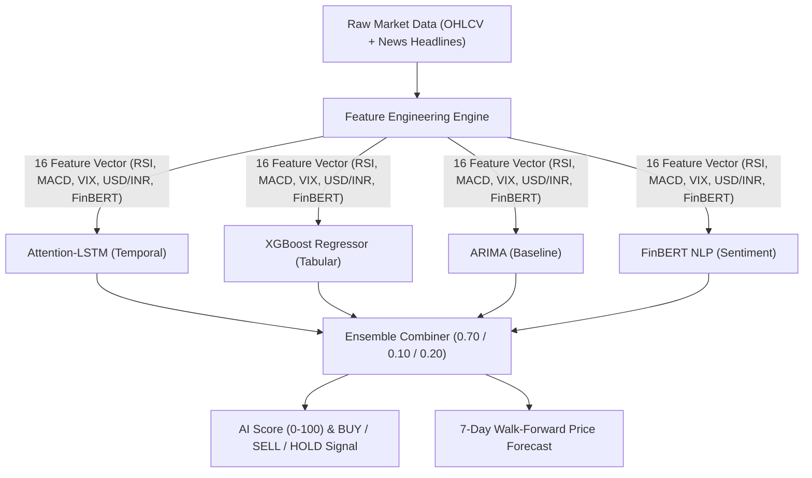
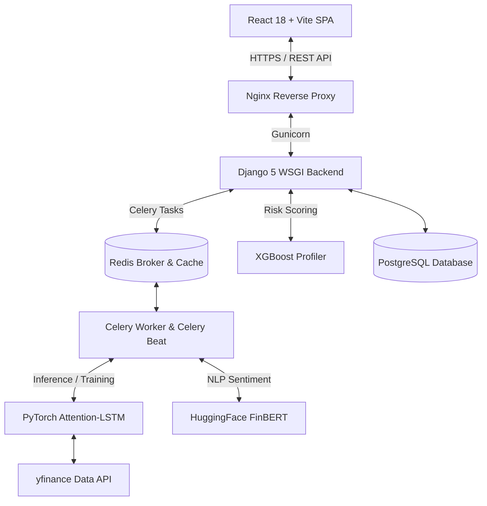
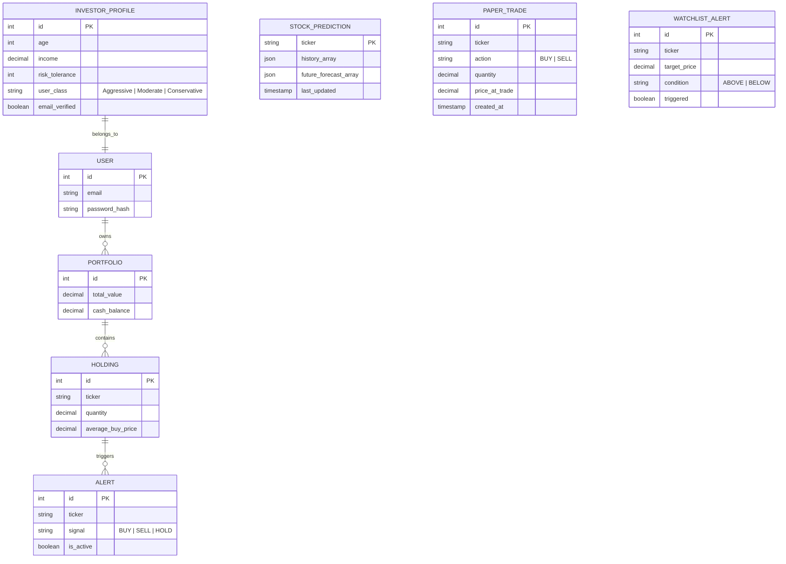

<div align="center">

  

  # 💎 CRESTA

  ### **Your Wealth, Powered by Intelligence**

  *Production-grade AI Robo-Advisory Platform for Indian Equity Markets*

  <br />

  [](https://reactjs.org/)
  [](https://djangoproject.com/)
  [](https://pytorch.org/)
  [](https://postgresql.org/)
  [](https://redis.io/)
  [](https://docker.com/)
  [](LICENSE)

  <br />

  **[🌐 Live Demo](https://crestafinance.me)** &nbsp;|&nbsp; **[📊 ML Specs](#-ml-evaluation-metrics)** &nbsp;|&nbsp; **[🏗️ Architecture](#️-system-architecture)** &nbsp;|&nbsp; **[🚀 Quick Start](#-quick-start)** &nbsp;|&nbsp; **[👥 Contributors](#-contributors)**

</div>

---

> [!IMPORTANT]
> **Cresta** bridges institutional-grade quantitative intelligence, behavioral risk analysis, and multilingual accessibility for over 200 Million Indian retail investors.

---

## 📸 Platform Overview & Screenshots

<table width="100%">
  <tr>
    <td align="center" width="50%">
      
      <br />
      <sub><b>Dark Mode Landing Page</b> — Live SENSEX/NIFTY ticker, interactive 3D COBE exchange globe, breathing emerald gradient.</sub>
    </td>
    <td align="center" width="50%">
      
      <br />
      <sub><b>Light Mode Landing Page</b> — Dynamic theme adaptation with high-contrast accessibility.</sub>
    </td>
  </tr>
  <tr>
    <td align="center" width="50%">
      
      <br />
      <sub><b>Intelligent Features</b> — AI Risk Profiling, Real-time Market Data, and Automated Rebalancing modules.</sub>
    </td>
    <td align="center" width="50%">
      
      <br />
      <sub><b>Authentication Suite</b> — Secure JWT auth, Google OAuth 2.0 integration, and sign-up flows.</sub>
    </td>
  </tr>
  <tr>
    <td align="center" width="50%">
      
      <br />
      <sub><b>Security & Verification</b> — Token-based SMTP email verification with 24-hour expiration.</sub>
    </td>
    <td align="center" width="50%">
      
      <br />
      <sub><b>Portfolio Analytics</b> — Real-time valuation, net P&L metrics, asset allocation breakdown, and AI alerts.</sub>
    </td>
  </tr>
  <tr>
    <td align="center" width="50%">
      
      <br />
      <sub><b>Holdings & AI Advisor</b> — Sparkline trend charts, BUY/SELL/HOLD signals, and Explainable AI score breakdown.</sub>
    </td>
    <td align="center" width="50%">
      
      <br />
      <sub><b>Market Watch & Forecast</b> — Stock search, 30-day historical trends, and 7-day walk-forward AI forecasts.</sub>
    </td>
  </tr>
  <tr>
    <td align="center" width="50%">
      
      <br />
      <sub><b>Personalized News Feed</b> — Reuters & Bloomberg sentiment analysis contextualized for portfolio holdings.</sub>
    </td>
    <td align="center" width="50%">
      
      <br />
      <sub><b>Preferences & Settings</b> — Investor profile controls, theme engine toggles, and multilingual switching.</sub>
    </td>
  </tr>
  <tr>
    <td align="center" colspan="2" width="100%">
      
      <br />
      <sub><b>Native Multilingual Support</b> — Comprehensive Hindi translation across navigation, AI reasoning, tooltips, and alerts (Gujarati & Punjabi also supported).</sub>
    </td>
  </tr>
</table>

---

## ⚡ Why Cresta?

Traditional brokerages provide execution, while basket providers offer static collections. **Cresta delivers a continuous AI reasoning engine.**

| Feature | Zerodha / Groww | Smallcase | Wealthfront | **Cresta** |
| :--- | :---: | :---: | :---: | :---: |
| **AI Stock Scoring** | ✕ | ✕ | Partial | **✅ Ensemble ML (LSTM + XGBoost + ARIMA + FinBERT)** |
| **Explainable Signals (XAI)** | ✕ | ✕ | ✕ | **✅ Sentiment / Risk Fit / Valuation breakdown** |
| **Native Indic Languages** | ✕ | ✕ | ✕ | **✅ English, Hindi, Gujarati & Punjabi** |
| **7-Day Quant Forecasting** | ✕ | ✕ | ✕ | **✅ Walk-forward validated ensemble** |
| **Automated Watchlist Alerts** | ✅ | ✕ | ✅ | **✅ Trigger-based email & UI notifications** |
| **ML Behavioral Risk Profiling** | ✕ | ✕ | ✅ | **✅ XGBoost trained on empirical NFCS survey data** |
| **Secure Email Verification** | ✕ | ✕ | ✅ | **✅ Token-based SMTP verification (24h expiry)** |

---

## 📊 ML Evaluation Metrics

### 1. 🧠 Behavioral Risk Profiling Engine

Cresta dynamically categorizes investors into **Conservative, Moderate, or Aggressive** risk classes based on financial capacity, demographic profiles, and behavioral risk tolerance.

* **Model Architecture:** XGBoost Classifier
* **Training Dataset:** 25,000 profiles — 2,578 empirical survey samples from the **NFCS 2021 Investor Survey** (FINRA Foundation) augmented with 22,422 synthetic profiles modeled after SEBI capacity guidelines and behavioral noise distributions.
* **Model Accuracy:** `68%` (Validated on heterogeneous synthetic noise)
* **Aggressive Class Recall:** `97%` — eliminating standard Moderate-bias classification bottlenecks.

#### Explainable AI (XAI) — Feature Importance
| Feature | Importance Weight | Description |
| :--- | :---: | :--- |
| **Risk Tolerance** | `61.35%` | Subjective risk willingness score |
| **Income** | `17.81%` | Annual financial capacity |
| **Investment Goal** | `14.75%` | Primary investment objective |
| **Age** | `3.88%` | Investment time horizon factor |
| **Experience** | `2.21%` | Market experience duration |

---

### 2. 📈 Hybrid Quant Stock Forecasting Engine

* **Architecture:** Attention-LSTM Hybrid + XGBoost + ARIMA Ensemble
* **Attention Mechanism:** Implements learned temporal weights across hidden states, prioritizing high-impact historical time steps rather than uniform sequence weighting.
* **Ensemble Weighting:** `0.70 LSTM` / `0.10 XGBoost` / `0.20 ARIMA` (Optimized via walk-forward Mean Absolute Percentage Error minimization).
* **Feature Vector (16 Features):** Close Price, Volume, SMA (5, 20), RSI (14), MACD, Bollinger Bands, On-Balance Volume (OBV), FinBERT Sentiment Score (scraped & aggregated from NSE headlines over 24h windows), USD/INR Exchange Rate, India VIX, Crude Oil Futures.
* **Validation Methodology:** Strict Walk-Forward Validation (3-fold expanding window with minimum 45-day evaluation windows) to ensure zero look-ahead bias.
* **Dataset:** 20 years of historical Nifty50 daily data (via Kaggle & `yfinance`).

#### Walk-Forward Validated Forecasting Performance
| Ticker | Sector | Avg Ensemble MAPE | Validation Status |
| :--- | :--- | :---: | :---: |
| **RELIANCE.NS** | Energy / Conglomerate | `1.33%` | ✅ Verified |
| **SUNPHARMA.NS** | Pharmaceuticals | `0.82%` | ✅ Verified |
| **ICICIBANK.NS** | Banking & Financials | `2.51%` | ✅ Verified |
| **HDFCBANK.NS** | Banking & Financials | `2.67%` | ✅ Verified |
| **INFY.NS** | Information Technology | `2.69%` | ✅ Verified |
| **TCS.NS** | Information Technology | `3.85%` | ✅ Verified |
| **ONGC.NS** | Oil & Gas | `4.30%` | ✅ Verified |
| **MARUTI.NS** | Automotive | `7.66%` | ✅ Verified |

> **Overall Test Set Ensemble MAPE:** **`3.23%`** *(Compared to baseline models at 11% - 18%)*

---

## 🔬 ML Pipeline Workflow



---

## 🏗️ System Architecture



### 🗄️ Database Schema (ERD)



---

## ✨ Core Features & Technical Highlights

* **🌍 Interactive 3D Exchange Globe:** Built with COBE & Three.js canvas. Visualizes 7 global exchanges (SENSEX, NIFTY 50, FTSE 100, NYSE/DOW, IBOVESPA, NIKKEI 225, ASX 200) with automatic continent camera tracking and dynamic theme adaptation.
* **🎨 Premium Emerald Design System:** Native Dark Mode (`#121212`) & Light Mode (`#F0F4F8`) with canvas-rendered breathing radial glows and floating ticker data particles.
* **🤖 Explainable Fiduciary Scoring (XAI):** 100-point fiduciary scoring algorithm comprising:
  * **Sentiment (40 pts):** FinBERT NLP on recent NSE news.
  * **Risk Fit (40 pts):** Stock Beta matched to user risk profile.
  * **Valuation (20 pts):** Price positioning within 52-week channels.
* **🌐 Native Multilingual Support (i18n):** Complete internationalization using `react-i18next` for **English, Hindi, Gujarati, and Punjabi**.
* **🔐 Security Infrastructure:** JWT authentication with rotation, tokenized email verification, OAuth 2.0 integration, and rate-limiting.

---

## 🛠️ Technology Stack

| Domain | Technology | Purpose |
| :--- | :--- | :--- |
| **Frontend** | React 18, Vite, TailwindCSS, COBE, Recharts | User Interface, 3D Globe, Data Visualization |
| **Backend** | Python 3.12, Django 5, DRF, Gunicorn | REST API Layer, Business Logic |
| **Database & Cache** | PostgreSQL 16, Redis 7 | Relational Storage, Caching, Celery Broker |
| **Machine Learning** | PyTorch, XGBoost, statsmodels, FinBERT | Ensemble Quant & Behavioral Risk Models |
| **MLOps & DevOps** | MLflow, Docker, Docker Compose, Nginx | Model Tracking, Containerization, Reverse Proxy |
| **Internationalization** | `react-i18next` | Multilingual support (EN, HI, GU, PA) |

---

## 📂 Project Architecture

```
Cresta/
├── frontend/             # React 18 + Vite SPA Client
├── backend/              # Django 5 REST Framework Backend
│   ├── advisor/          # Core Django Application
│   └── robo_advisor/     # Django Project Settings & Routing
├── mlmodel/              # Quant ML Models & Training Scripts
│   └── recommender/      # Recommender Engine Package
├── chatbot/              # CRESTA AI Chatbot Service Module
└── docker-compose.yml    # Multi-container Orchestration
```

---

## 🚀 Quick Start Guide

### 🐳 Option A: Using Docker (Recommended)

1. **Clone the repository:**
   ```bash
   git clone https://github.com/ankitrmishra01/Cresta1.git
   cd Cresta1
   ```

2. **Configure Environment Variables:**
   ```bash
   cp .env.example .env
   ```

3. **Launch the Container Stack:**
   ```bash
   docker-compose up --build -d
   ```

4. **Access the Application:**
   * **Web App:** `http://localhost`
   * **Backend API:** `http://localhost/api/`

---

### 💻 Option B: Native Development Setup

#### Backend Setup
```bash
cd backend
python -m venv venv

# Activate Virtual Environment:
# On Linux/macOS:
source venv/bin/activate
# On Windows:
venv\Scripts\activate

pip install -r requirements.txt
pip install -r ../mlmodel/requirements.txt

# Set PYTHONPATH to include mlmodel:
# On Linux/macOS:
export PYTHONPATH="$PYTHONPATH:$(pwd)/../mlmodel"
# On Windows (PowerShell):
$env:PYTHONPATH="$env:PYTHONPATH;..\mlmodel"

python manage.py migrate
python manage.py runserver 8000
```

#### Frontend Setup
```bash
cd frontend
npm install
npm run dev
```

---

## ⚙️ Environment Configuration

| Variable | Description | Default |
| :--- | :--- | :--- |
| `SECRET_KEY` | Django Secret Key | Required |
| `DEBUG` | Django Debug Mode | `False` |
| `DATABASE_URL` | PostgreSQL Connection String | `postgresql://...` |
| `REDIS_URL` | Redis Cache / Broker URL | `redis://localhost:6379/0` |
| `ALLOWED_HOSTS` | Allowed Hostnames | `localhost,127.0.0.1` |
| `CORS_ALLOWED_ORIGINS` | CORS Allowed Origins | `http://localhost:5173` |
| `EMAIL_HOST_USER` | SMTP Sender Email | Required for Email Verification |
| `EMAIL_HOST_PASSWORD` | SMTP Application Password | Required for Email Verification |

---

## 🗺️ Roadmap & Future Enhancements

- [ ] **Oracle Cloud Deployment** — Production deployment on ARM 4 OCPU / 24GB RAM instance.
- [ ] **Interactive Backtesting Engine** — Benchmark custom strategies against Nifty 50 with CAGR and Sharpe analytics.
- [ ] **Derivatives & Options Chain Visualizer** — Real-time IV surface and Options Greeks calculation.
- [ ] **Mutual Fund Portfolio Coverage** — Expand fiduciary AI scoring to Indian Direct Mutual Funds.
- [ ] **Mobile Native App** — React Native companion app with push notification alerts.

---

## 📚 Academic References

1. **Hochreiter, S., & Schmidhuber, J. (1997).** Long Short-Term Memory. *Neural Computation*, 9(8), 1735–1780.
2. **Vaswani, A., et al. (2017).** Attention Is All You Need. *Advances in Neural Information Processing Systems (NeurIPS)*.
3. **Araci, D. (2019).** FinBERT: Financial Sentiment Analysis with Pre-trained Language Models. *arXiv:1908.10063*.
4. **Chen, T., & Guestrin, C. (2016).** XGBoost: A Scalable Tree Boosting System. *ACM KDD '16*.
5. **Markowitz, H. (1952).** Portfolio Selection. *The Journal of Finance*, 7(1), 77–91.

---

## 👥 Contributors

<div align="center">

| [<br /><sub><b>Ankit Mishra</b></sub>](https://github.com/ankitrmishra01) | [<br /><sub><b>Shivam Panchal</b></sub>](https://github.com/Shivam-Panchal0210) | [<br /><sub><b>Shubham Kumar Jha</b></sub>](https://github.com/Coder-jhaji7) | [<br /><sub><b>Om Sharma</b></sub>](https://github.com/Cypher-redeye) |
| :---: | :---: | :---: | :---: |

</div>

---

<div align="center">
  <sub><i>Cresta is a production-ready, highly localized Robo-Advisory platform demonstrating the viable intersection of behavioral finance, deep learning, and modern web architecture.</i></sub>
</div>
